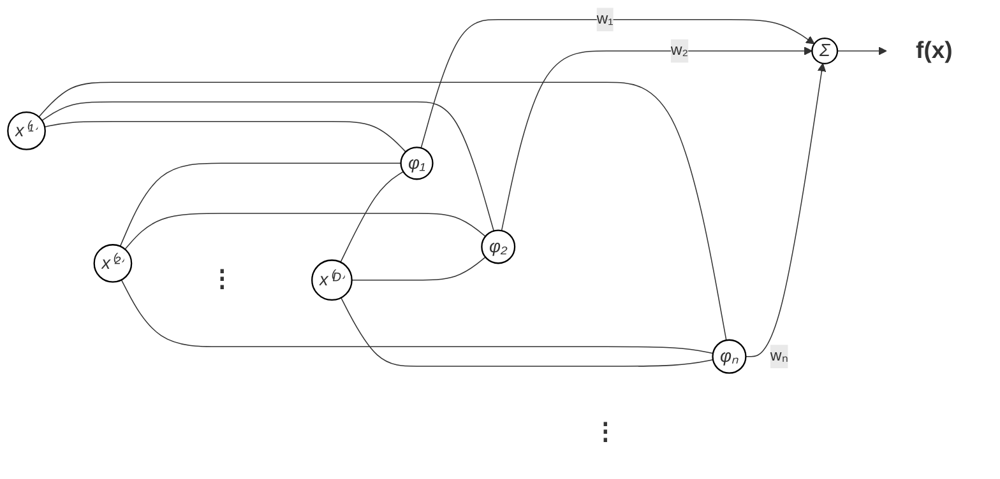

```mermaid
graph LR
    %% 定义节点样式（白底、黑边、圆形）
    classDef circleNode fill:#ffffff,stroke:#000000,stroke-width:1.5px,shape:circle,font-size:18px,font-style:italic;
    classDef textNode fill:none,stroke:none,font-size:24px,font-weight:bold;

    %% 1. 输入层节点
    x1(("x⁽¹⁾")):::circleNode
    x2(("x⁽²⁾")):::circleNode
    xdot["⋮"]:::textNode
    xD(("x⁽ᴰ⁾")):::circleNode

    %% 2. 隐含层节点
    phi1(("φ₁")):::circleNode
    phi2(("φ₂")):::circleNode
    phidot["⋮"]:::textNode
    phiN(("φₙ")):::circleNode

    %% 3. 输出层节点
    Sigma(("Σ")):::circleNode
    Output["f(x)"]:::textNode

    %% 4. 输入层 -> 隐含层连线 (全连接交叉，无箭头实线)
    x1 --- phi1
    x1 --- phi2
    x1 --- phiN
    
    x2 --- phi1
    x2 --- phi2
    x2 --- phiN
    
    xD --- phi1
    xD --- phi2
    xD --- phiN

    %% 5. 隐含层 -> 输出层连线 (带箭头，标注权重)
    phi1 -->|w₁| Sigma
    phi2 -->|w₂| Sigma
    phiN -->|wₙ| Sigma

    %% 6. 最终输出
    Sigma --> Output

    %% 7. 辅助对齐 (让同层节点保持垂直分布)
    x1 ~~~ x2 ~~~ xdot ~~~ xD
    phi1 ~~~ phi2 ~~~ phidot ~~~ phiN
```