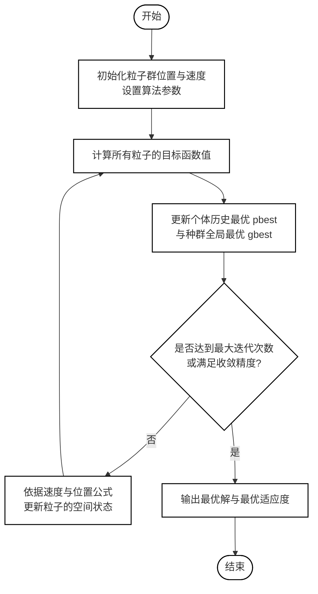

```mermaid
graph TD
    %% 定义节点样式：圆角矩形用于开始/结束，直角矩形用于处理，菱形用于判断
    classDef startend fill:#ffffff,stroke:#000000,stroke-width:1.5px,shape:rect,rx:15,ry:15,font-size:16px;
    classDef process fill:#ffffff,stroke:#000000,stroke-width:1.5px,font-size:16px;
    classDef decision fill:#ffffff,stroke:#000000,stroke-width:1.5px,shape:diamond,font-size:16px;

    %% 定义节点
    Start([开始]):::startend
    Init[初始化粒子群位置与速度 \n 设置算法参数]:::process
    Eval[计算所有粒子的目标函数值]:::process
    UpdateBest[更新个体历史最优 pbest \n 与种群全局最优 gbest]:::process
    Check{是否达到最大迭代次数 \n 或满足收敛精度?}:::decision
    UpdatePosVel[依据速度与位置公式 \n 更新粒子的空间状态]:::process
    Output[输出最优解与最优适应度]:::process
    End([结束]):::startend

    %% 连接节点
    Start --> Init
    Init --> Eval
    Eval --> UpdateBest
    UpdateBest --> Check
    Check -->|否| UpdatePosVel
    UpdatePosVel --> Eval
    Check -->|是| Output
    Output --> End 
```