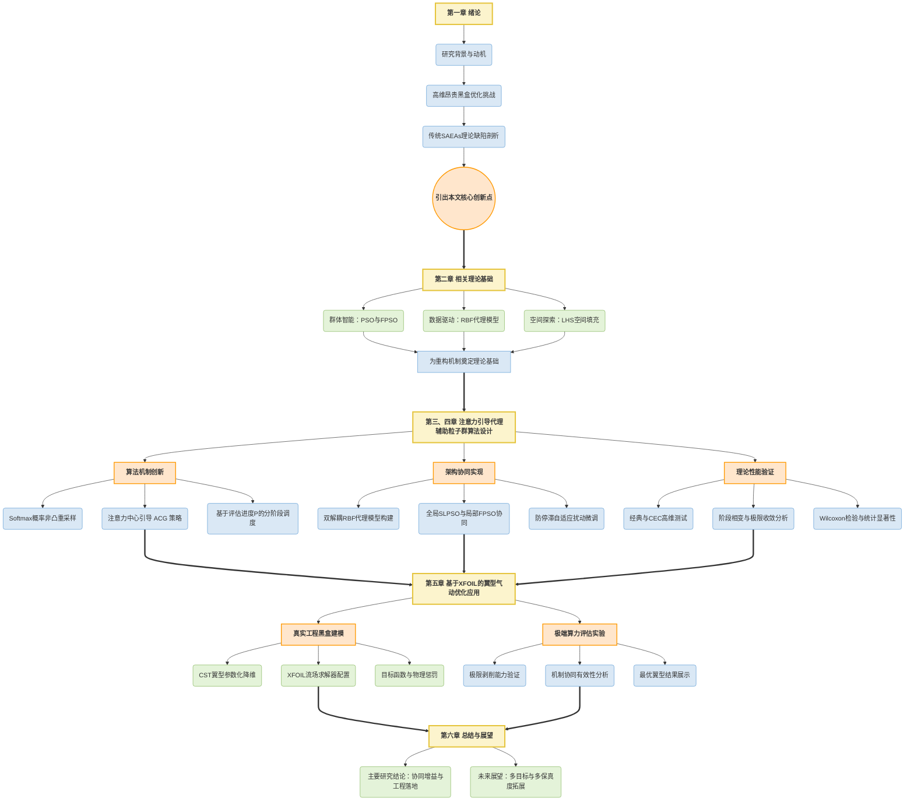

```mermaid
flowchart TD
    %% 定义主题颜色样式 (深度模仿学长图配色)
    classDef mainNode fill:#fcf4cd,stroke:#e5c43d,stroke-width:3px,color:#333,font-weight:bold;
    classDef highlight fill:#ffe6cc,stroke:#ff9900,stroke-width:2px,color:#333,font-weight:bold;
    classDef lightGreen fill:#e4f3d9,stroke:#85b55c,stroke-width:1px,color:#333;
    classDef lightBlue fill:#dae8f5,stroke:#5b9bd5,stroke-width:1px,color:#333;

    %% 【模块一：第一章】
    CH1[第一章 绪论]:::mainNode
    CH1 --> B1(研究背景与动机):::lightBlue
    B1 --> B2(高维昂贵黑盒优化挑战):::lightBlue
    B2 --> B3(传统SAEAs理论缺陷剖析):::lightBlue
    B3 --> B4((引出本文核心创新点)):::highlight

    %% 强制垂直连接线
    B4 ===> CH2

    %% 【模块二：第二章】
    CH2[第二章 相关理论基础]:::mainNode
    CH2 --> T1(群体智能：PSO与FPSO):::lightGreen
    CH2 --> T2(数据驱动：RBF代理模型):::lightGreen
    CH2 --> T3(空间探索：LHS空间填充):::lightGreen
    T1 & T2 & T3 --> T4[为重构机制奠定理论基础]:::lightBlue

    %% 强制垂直连接线
    T4 ===> CH3

    %% 【模块三：第三、四章】
    CH3[第三、四章 注意力引导代理辅助粒子群算法设计]:::mainNode
    CH3 --> D1[算法机制创新]:::highlight
    CH3 --> D2[架构协同实现]:::highlight
    CH3 --> D3[理论性能验证]:::highlight

    D1 --> D1a(Softmax概率非凸重采样):::lightBlue
    D1 --> D1b(注意力中心引导 ACG 策略):::lightBlue
    D1 --> D1c(基于评估进度P的分阶段调度):::lightBlue

    D2 --> D2a(双解耦RBF代理模型构建):::lightBlue
    D2 --> D2b(全局SLPSO与局部FPSO协同):::lightBlue
    D2 --> D2c(防停滞自适应扰动微调):::lightBlue

    D3 --> D3a(经典与CEC高维测试):::lightBlue
    D3 --> D3b(阶段相变与极限收敛分析):::lightBlue
    D3 --> D3c(Wilcoxon检验与统计显著性):::lightBlue

    %% 强制垂直连接线
    D1b & D2b & D3b ===> CH5

    %% 【模块四：第五章】
    CH5[第五章 基于XFOIL的翼型气动优化应用]:::mainNode
    CH5 --> A1[真实工程黑盒建模]:::highlight
    CH5 --> A2[极端算力评估实验]:::highlight

    A1 --> A1a(CST翼型参数化降维):::lightGreen
    A1 --> A1b(XFOIL流场求解器配置):::lightGreen
    A1 --> A1c(目标函数与物理惩罚):::lightGreen

    A2 --> A2a(极限剥削能力验证):::lightBlue
    A2 --> A2b(机制协同有效性分析):::lightBlue
    A2 --> A2c(最优翼型结果展示):::lightBlue

    %% 强制垂直连接线
    A1b & A2b ===> CH6

    %% 【模块五：第六章】
    CH6[第六章 总结与展望]:::mainNode
    CH6 --> C1(主要研究结论：协同增益与工程落地):::lightGreen
    CH6 --> C2(未来展望：多目标与多保真度拓展):::lightGreen
```