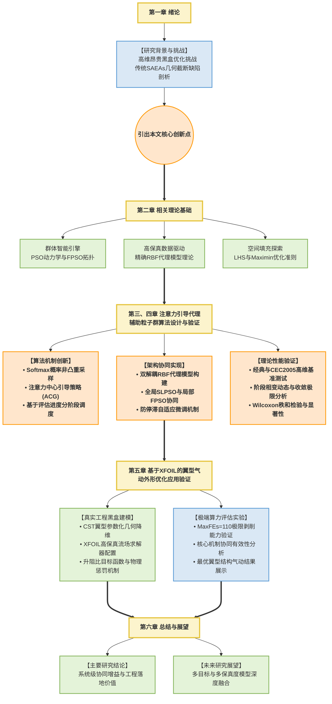

```mermaid
flowchart TD
    %% 定义主题颜色样式 
    classDef mainNode fill:#fcf4cd,stroke:#e5c43d,stroke-width:3px,color:#333,font-weight:bold,font-size:16px;
    classDef highlight fill:#ffe6cc,stroke:#ff9900,stroke-width:2px,color:#333,font-weight:bold;
    classDef lightGreen fill:#e4f3d9,stroke:#85b55c,stroke-width:2px,color:#333;
    classDef lightBlue fill:#dae8f5,stroke:#5b9bd5,stroke-width:2px,color:#333;

    %% --- 模块一与模块二 ---
    CH1["第一章 绪论"]:::mainNode --> B1["【研究背景与挑战】
    高维昂贵黑盒优化挑战
    传统SAEAs几何截断缺陷剖析"]:::lightBlue
    
    B1 --> B2(("引出本文核心创新点")):::highlight

    B2 ===> CH2["第二章 相关理论基础"]:::mainNode

    CH2 --> T1["群体智能引擎
    PSO动力学与FPSO拓扑"]:::lightGreen
    CH2 --> T2["高保真数据驱动
    精确RBF代理模型理论"]:::lightGreen
    CH2 --> T3["空间填充探索
    LHS与Maximin优化准则"]:::lightGreen

    %% --- 模块三 ---
    T2 ===> CH3["第三、四章 注意力引导代理辅助粒子群算法设计与验证"]:::mainNode

    CH3 --> D1["【算法机制创新】
    • Softmax概率非凸重采样
    • 注意力中心引导策略 (ACG)
    • 基于评估进度分阶段调度"]:::highlight

    CH3 --> D2["【架构协同实现】
    • 双解耦RBF代理模型构建
    • 全局SLPSO与局部FPSO协同
    • 防停滞自适应微调机制"]:::highlight

    CH3 --> D3["【理论性能验证】
    • 经典与CEC2005高维基准测试
    • 阶段相变动态与收敛极限分析
    • Wilcoxon秩和检验与显著性"]:::highlight

    %% --- 模块四 ---
    D2 ===> CH5["第五章 基于XFOIL的翼型气动外形优化应用验证"]:::mainNode

    CH5 --> A1["【真实工程黑盒建模】
    • CST翼型参数化几何降维
    • XFOIL高保真流场求解器配置
    • 升阻比目标函数与物理惩罚机制"]:::lightGreen

    CH5 --> A2["【极端算力评估实验】
    • MaxFEs=110极限剥削能力验证
    • 核心机制协同有效性分析
    • 最优翼型结构气动结果展示"]:::lightBlue

    %% --- 模块五 ---
    A1 & A2 ===> CH6["第六章 总结与展望"]:::mainNode

    CH6 --> C1["【主要研究结论】
    系统级协同增益与工程落地价值"]:::lightGreen
    
    CH6 --> C2["【未来研究展望】
    多目标与多保真度模型深度融合"]:::lightGreen
```