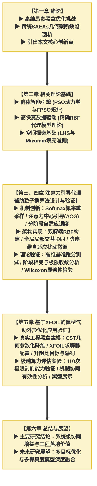

```mermaid
flowchart TD
    classDef main fill:#fcf4cd,stroke:#e5c43d,stroke-width:2px,color:#333,font-weight:bold,font-size:15px;

    L1["【第一章 绪论】<br/>▶ 高维昂贵黑盒优化挑战<br/>▶ 传统SAEAs几何截断缺陷剖析<br/>▶ 引出本文核心创新点"]:::main
    
    L2["【第二章 相关理论基础】<br/>▶ 群体智能引擎 (PSO动力学与FPSO拓扑)<br/>▶ 高保真数据驱动 (精确RBF代理模型理论)<br/>▶ 空间探索基础 (LHS与Maximin填充准则)"]:::main
    
    L3["【第三、四章 注意力引导代理辅助粒子群算法设计与验证】<br/>▶ 机制创新：Softmax概率重采样 / 注意力中心引导(ACG) / 分阶段自适应调度<br/>▶ 架构实现：双解耦RBF构建 / 全局局部交替协同 / 防停滞自适应扰动微调<br/>▶ 理论验证：高维基准跑分测试 / 阶段相变与极限收敛分析 / Wilcoxon显著性检验"]:::main
    
    L4["【第五章 基于XFOIL的翼型气动外形优化应用验证】<br/>▶ 真实工程黑盒建模：CST几何参数化降维 / XFOIL求解器配置 / 升阻比目标与惩罚<br/>▶ 极端算力评估实验：110次极限剥削能力验证 / 机制协同有效性分析 / 翼型展示"]:::main
    
    L5["【第六章 总结与展望】<br/>▶ 主要研究结论：系统级协同增益与工程落地价值<br/>▶ 未来研究展望：多目标优化与多保真度模型深度融合"]:::main

    L1 ===> L2 ===> L3 ===> L4 ===> L5
```