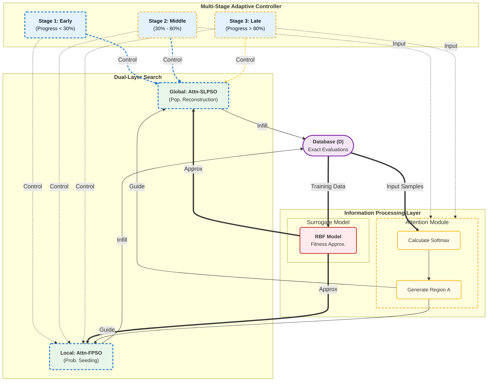

```mermaid
---
config:
  layout: dagre
---
graph TB
    %% 节点样式定义
    classDef stage fill:#e3f2fd,stroke:#1565c0,stroke-width:2px,rx:5,ry:5,font-size:14px,color:#0d1a26
    classDef attention fill:#fffde7,stroke:#fbc02d,stroke-width:2px,rx:5,ry:5,font-size:14px
    classDef search fill:#e8f5e9,stroke:#2e7d32,stroke-width:2px,rx:5,ry:5,font-size:14px
    classDef data fill:#f3e5f5,stroke:#7b1fa2,stroke-width:2px,shape:cylinder,font-size:14px
    classDef model fill:#ffebee,stroke:#c62828,stroke-width:2px,rx:5,ry:5,font-size:14px
    classDef container fill:#ffffff,stroke:#9e9e9e,stroke-width:1px,stroke-dasharray:5 5
    classDef lineblue stroke:#1976d2,stroke-width:2.5px,stroke-dasharray:6 4
    classDef lineorange stroke:#f9a825,stroke-width:2px,stroke-dasharray:6 4
    classDef labels font-size:15px,font-weight:bold

    %% 节点定义
    subgraph Controller ["<span style='font-size:18px;font-weight:bold;'>Multi-Stage Adaptive Controller</span>"]
        direction LR
        S1["<b>Stage 1: Early</b><br/>(Progress < 30%)"]:::stage
        S2["<b>Stage 2: Middle</b><br/>(30% - 80%)"]:::stage
        S3["<b>Stage 3: Late</b><br/>(Progress > 80%)"]:::stage
    end
    subgraph InfoLayer ["<span style='font-size:16px;font-weight:bold;'>Information Processing Layer</span>"]
        direction LR
        subgraph AttnModule ["Attention Module"]
            direction TB
            Softmax[Calculate Softmax]:::attention
            Region[Generate Region A]:::attention
        end
        subgraph ModelModule ["Surrogate Model"]
            direction TB
            RBF["<b>RBF Model</b><br/>Fitness Approx."]:::model
        end
    end
    subgraph Execution ["<span style='font-size:16px;font-weight:bold;'>Dual-Layer Search</span>"]
        direction LR
        Global["<b>Global: Attn-SLPSO</b><br/>(Pop. Reconstruction)"]:::search
        Local["<b>Local: Attn-FPSO</b><br/>(Prob. Seeding)"]:::search
    end
    DB(["<b>Database (D)</b><br/>Exact Evaluations"]):::data

    %% 控制线合并
    S1 & S2 & S3 -. Control .-> Global
    S1 & S2 & S3 -. Control .-> Local
    class S1,S2,S3,Global,Local lineblue

    %% S2 & S3 共同虚线到 AttnModule
    S2 & S3 -. Input .-> AttnModule
    class S2,S3,AttnModule lineorange

    %% InfoLayer各自连线
    DB ===>|Training Data| RBF
    DB ===>|Input Samples| Softmax
    Softmax --> Region
    RBF ==>|Approx| Global
    RBF ==>|Approx| Local
    Region -->|Guide| Global
    Region -->|Guide| Local
    Global -->|Infill| DB
    Local -->|Infill| DB

    %% 设置字体
    class Controller,InfoLayer,Execution labels

    %% 虚线样式进一步细化
    linkStyle 0,1 stroke:#1976d2,stroke-width:2.5px,stroke-dasharray:6 4
    linkStyle 2 stroke:#fbc02d,stroke-width:2px,stroke-dasharray:6 4
```